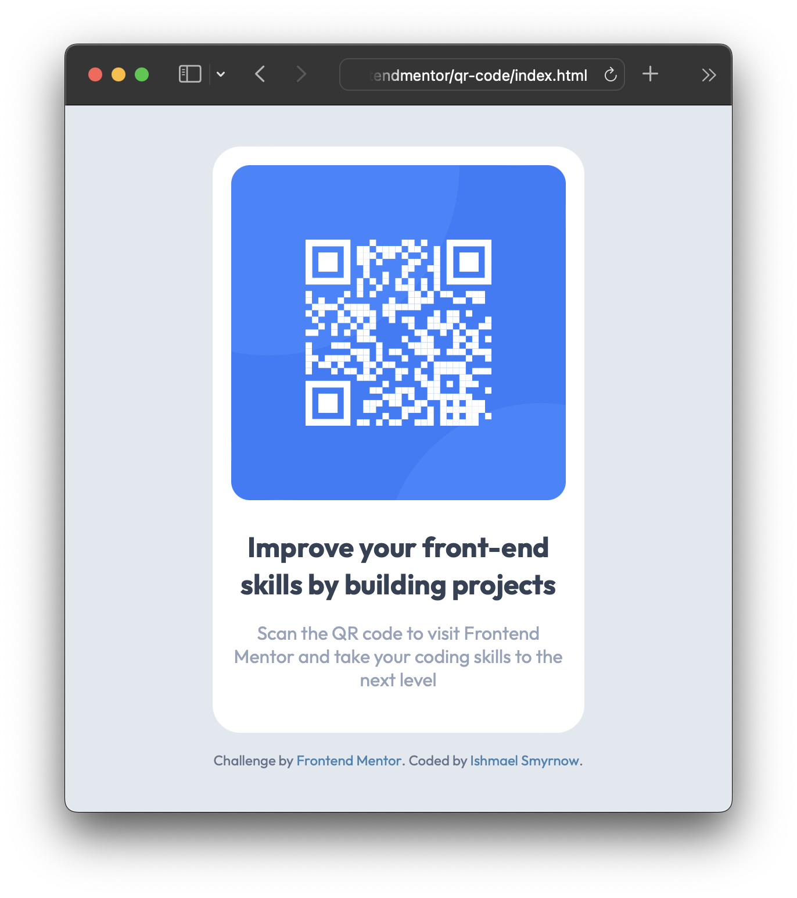

# Frontend Mentor - QR code component solution

This is a solution to the [QR code component challenge on Frontend Mentor](https://www.frontendmentor.io/challenges/qr-code-component-iux_sIO_H). Frontend Mentor challenges help you improve your coding skills by building realistic projects. 

## Table of contents

- [Overview](#overview)
  - [Screenshot](#screenshot)
  - [Links](#links)
- [My process](#my-process)
  - [Built with](#built-with)
  - [What I learned](#what-i-learned)
  - [Continued development](#continued-development)
  - [Useful resources](#useful-resources)
- [Author](#author)
- [Acknowledgments](#acknowledgments)

## Overview

### Screenshot



### Links

- Solution URL: [https://www.frontendmentor.io/solutions/simple-site-using-tailwindcss-via-cdn-YLGWHxzLCE](https://www.frontendmentor.io/solutions/simple-site-using-tailwindcss-via-cdn-YLGWHxzLCE)
- Live Site URL: [https://ismyrnow.github.io/frontendmentor-qr-code/](https://ismyrnow.github.io/frontendmentor-qr-code/)

## My process

### Built with

- Basic HTML and CSS (no compiler)
- TailwindCSS (via CDN, to keep things simple)
- Flexbox
- Mobile-first workflow

### What I learned

- Became more familar with Tailwind classes.
- Figured out solution for fully centered content.
```html
<body class="flex flex-col items-center justify-around min-h-screen">
  <div class="mt-auto mb-auto">
```
- Learned about a few things that require customizing the Tailwind theme:
  - Custom font family
  - Custom font sizes
- Learned that Google Fonts are easier than ever to use.
  - Pick font, pick weights, grab embed code (no JS needed), add CSS (Google provides snippet for this too).

### Continued development

I won't be touching this solution again, as it's quite complete. However, there are a few things I would like to do/learn next:

- Try using Tailwind with PostCSS to get access to theme customization.
- Include prettier, because I miss auto-formatting in VSCode.

### Useful resources

- [Tailwind Docs](https://tailwindcss.com/docs/installation) - Used this heavily. Their search makes finding needed classes easy when you know what css attribute you need.

**Note: Delete this note and replace the list above with resources that helped you during the challenge. These could come in handy for anyone viewing your solution or for yourself when you look back on this project in the future.**

## Author

- Website - [Ishmael Smyrnow](https://www.github.com/ismyrnow)
- Frontend Mentor - [@ismyrnow](https://www.frontendmentor.io/profile/ismyrnow)

## Acknowledgments

Thanks to Ilya Radchenko for encouraging the team at TeamGantt to use Tailwind. I think it's going to be a boon for future development.

Thanks to Josh Weaver for showing what's possible with Tailwind theme customization.